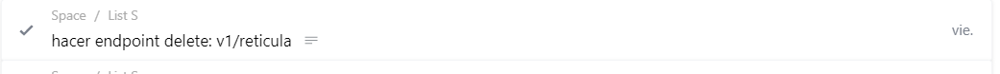
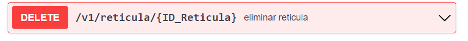
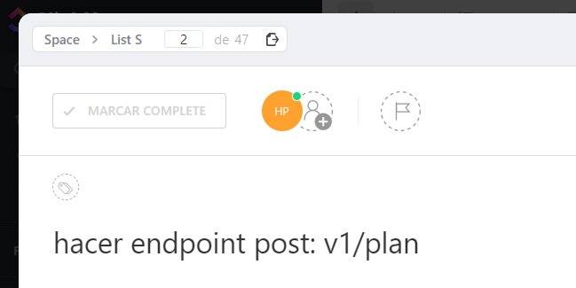
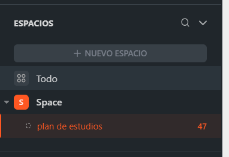
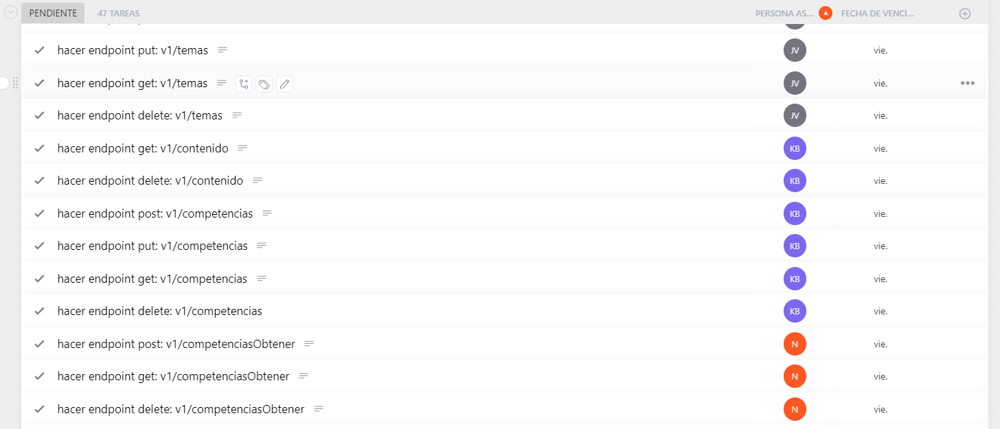

## clickup
clickup será nuestro gestor de tareas, aquí les asignare las tareas que deberán realizar en algún periodo de tiempo específico, una vez que hayan creado su cuenta y les envié la invitación para colaborar entonces podrán ver la interfaz principal de clickup.

## inicio

Al inicio podemos ver que está la sección llamada "Mi trabajo" esta sección está subdividida en varias secciones que son: "hoy", "vencido" y "siguiente". Por lo regular les estaré dejando varias tareas para varios días después por lo que las tareas les aparecerán en la sección "siguiente".
 
en la sección vencido son tareas que no se encuentran completadas después de que venció el plazo de entrega, esto en SCRUM se le conoce como deuda técnica.

## tareas

las tareas cuentan con un título, en este les describiré el endpoint que tienen que realizar, en la descripción no explicaré mucho ya que en swagger se encuentran la mayoría de instrucciones y formatos que tienen que seguir en su endpoint.

cada nombre hace referencia a un endpoint de swagger por lo que hay que dirigirse a la sección en este caso retícula y el método que en este caso es delete por lo que este endpoint es el equivalente a esta tarea:

En este caso el endpoint en swagger cuenta con un parámetro de tipo path (ID_Reticula) pero estos no serán tomados en cuenta en el nombre de la tarea de clickup, cada tarea es única y hace referencia a un único endpoint.
 
si tienen alguna duda de como trabajar con swagger favor de leer el manual de swagger dentro del canal manuales en discord.
 
cuando den click en una tarea esta se abrirá como un modal y aquí pueden ver más detalles de la tarea como por ejemplo una descripción más específica de la tarea, el historial de cambios pueden incluso medir el tiempo que les llevó completar la tarea con un cronómetro, archivos adjuntos, subtareas, etc.
 
una vez que terminen la tarea tiene que dar en el botón MARCAR COMPLETE para que la tarea se complete, cuando den click en este botón la tarea desaparecerá de pendiente y se irá a Acabado para que continúen con otra tarea, en el mundo laboral les piden que solo hagan una tarea a la vez así que seguiremos este estándar.

## espacios

cada servicio contará con un espacio diferente, en inicio les aparecerán todas las tareas de todos los espacios pero si así lo prefieren pueden irse a la sección espacios en la barra lateral y ver los diferentes espacios de trabajo que tenemos

Al entrar a un espacio entonces podrán ver todas las tareas incluyendo las suyas y de sus compañeros 

Por último quisiera agregar que habrán ciertas utilidades que no se estarán utilizando por que son premium así que les recomiendo que investiguen por su cuenta las metodologías Agile y SCRUM ya que son muy utilizadas en el mundo laboral para la gestión de proyectos.